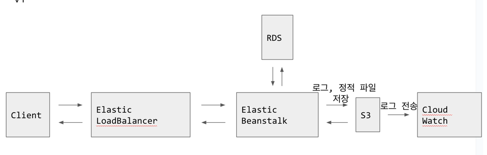

# Version 1
1. 2023.05.05 황성찬 작성

## Architecture


## 사전준비
1. Terraform Cloud 토큰
    1. Terraform Cloud 로그인
    2. 프로필 클릭 -> User Settings
    3. Tokens
    4. Create an API Token
2. AWS Credentials
    1. ACCESS_KEY, SECRET_KEY 발급 [공식문서](https://docs.aws.amazon.com/ko_kr/IAM/latest/UserGuide/id_credentials_access-keys.html) 참고

## 환경변수
`.env.tmpl` 설명 참고

## Deploy
```shell
$ cp .env.tmpl .env
$ docker build -t aws:v1 .
$ docker run -d --name awsv1 aws:v1 && docker exec -it --env-file ./infrastructure/.env awsv1 /bin/sh
(conatiner shell) $ cdktf deploy  
(container shell) $ cdktf output
(container shell) $ exit
$ docker kill awsv1 | docker container rm awsv1
```

## Destroy
```
$ cp .env.tmpl .env
$ docker build -t aws:v1 .
$ docker run -d --name awsv1 aws:v1 && docker exec -it --env-file ./infrastructure/.env awsv1 /bin/sh
(conatiner shell) $ cdktf deploy
(container shell) $ exit
$ docker kill awsv1 | docker container rm awsv1
$ cdktf destroy
```
### 주의사항
배포 후 웹 콘솔에서 직접 인프라를 수정하면 terraform state file 파일과의 동기화가 불가능하여 더 이상 terraform으로 인프라를 제거할 수 없습니다.

## Output
`$ cdktf ouput` 명령어를 입력해서 생성된 인프라 정보를 확인할 수 있습니다.
1. DB-INSTANCE-ENDPOINT: RDS의 endpoint입니다. endpoint를 통해서 RDS로 접근할 수 있습니다.
2. EB-ENDPOINT: ElasticBeanstalk 환경의 Endpoint 입니다.
3. S3-BUCKET-NAME: 생성된 S3 Bucket의 이름입니다.
4. S3-DNS: 생성된 S3의 도메인입니다.


## 특징
1. 초기 인프라 셋팅에 특화되어 있습니다. 코드를 지속적으로 수정하며 인프라를 관리하기에는 적합하지 않습니다.
2. 첫 배포 이후 배포 자동화를 직접 구성해야합니다. [ElasticBeanstalk Deploy Action](https://github.com/marketplace/actions/beanstalk-deploy) 추천

## 다음목표
* Tag 일괄등록
* [MongoDB](https://registry.terraform.io/providers/mongodb/mongodbatlas/latest/docs) 프로비저닝 제공
* Cloud Watch 로그 스트림 제공
* 마이그레이션 스크립트 제공
